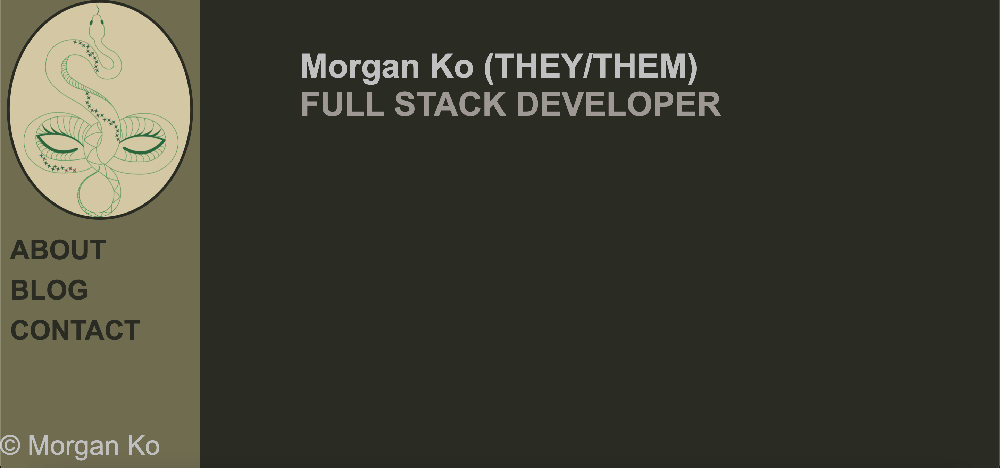
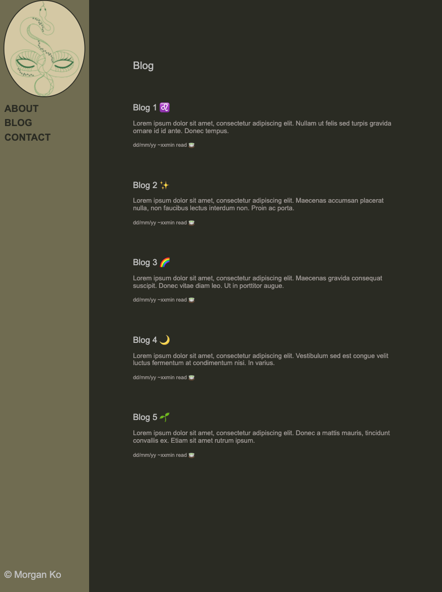
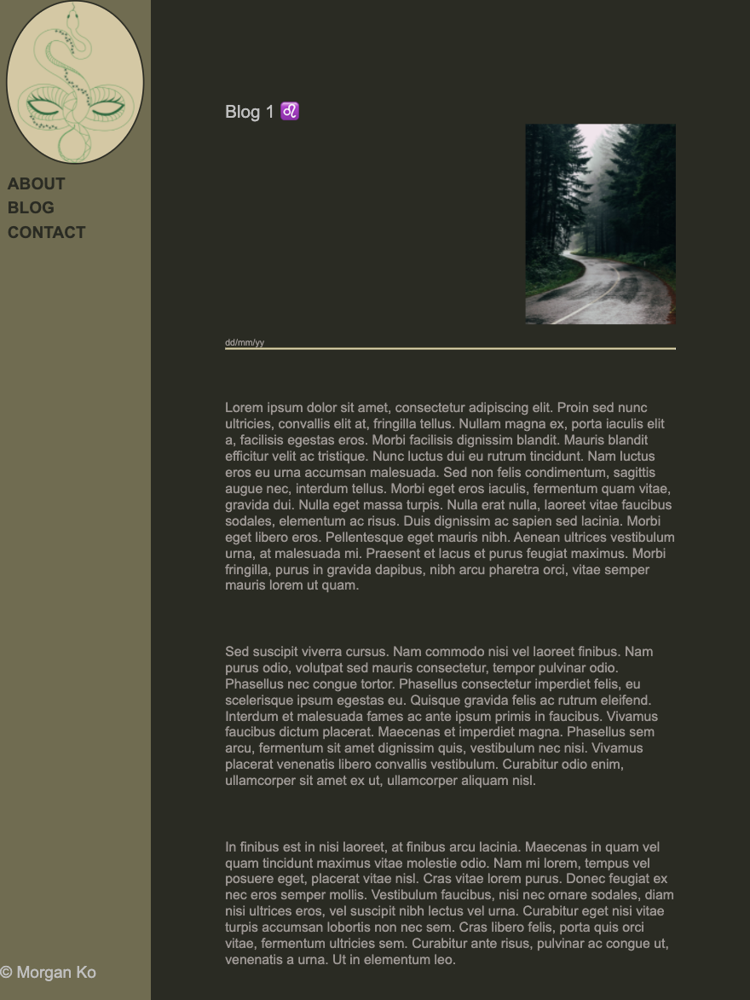
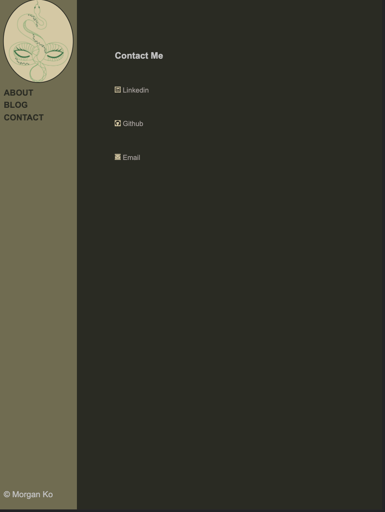

# README

## A link (URL) to your published portfolio website
[Portfolio](https://mko-portfolio.netlify.app/)

## A link to your GitHub repo
[Github](https://github.com/MKO122/MorganKo_T1A2)

## Description of your portfolio website, including,

- Purpose
- Functionality / features
- Sitemap
- Screenshots
- Target audience
- Tech stack (e.g. html, css, deployment platform, etc)

This website is designed with a thematic to reflect the persona of the developer.

It's purpose is to showcase the personality, knowledge and abilities of the developer so inteerested parties are able to reach out and express their interest in any form.

This site includes a homepage which identifies the developer with a vertical navigation bar so that they may explore the space. This links to other sections that currently include but not limited to; an 'About Me' section to learn more about the developer's interests, experiences and academic qualifications; A 'Blog' where the developer may share and showcase interesting pieces of information and news; And a 'Contact' page that allows for multi-channel communications.

A sitemap can be viewed here

Screenshots of the website can can be viewed here

The target audience is primarily potential employers and clients looking to recruit a junior full stack developer or commission a project based off their knowledge and ability.

The current stack utilised for this website is html, css and SASS.

I have also attached a link here [Presentation](https://view.genial.ly/618a4a5682bee00d47832e40/guide-portfolio) to view the presentation in it's live form as the offline version in pdf is not as responsive, detailed or dynamic.